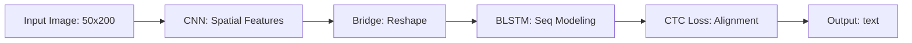

# Captcha Recognition System

An automated end-to-end CAPTCHA recognition system evolved from traditional machine learning to state-of-the-art Deep Learning (CRNN+CTC). This project demonstrates the journey of improving OCR accuracy from 44% to over 98%.

## 🚀 Project Evolution

This project underwent three major phases of technical improvement:

### Phase 1: traditional ML (SVM + HOG)
- **Method**: Character segmentation (Otsu's thresholding) + HOG Feature Extraction + LinearSVC.
- **Limitation**: Highly sensitive to segmentation errors; struggling with overlapping characters.
- **Accuracy**: ~44%.

### Phase 2: Deep Learning (CNN)
- **Method**: Improved segmentation + 4-layer CNN for character classification.
- **Link**: [Original CNN Research](file:///Users/parkyoungdu/Documents/GitHub/Captcha/scripts/train_cnn.py)
- **Accuracy**: ~91% (Character level).

### Phase 3: Sequential Recognition (CRNN + CTC)
- **Method**: **C**NN (Feature extraction) + **R**NN (BLSTM for sequence) + **C**TC Loss (Alignment).
- **Advantage**: **No explicit segmentation required.** Recognizes the entire 5-character sequence as a whole.
- **Accuracy**: **98.13% (Word Accuracy) / 98.88% (Char Accuracy).**

---

## 🏗️ Architecture: CRNN + CTC



- **Backbone**: CNN Layers for visual feature extraction.
- **Sequence**: Bidirectional LSTM for context modeling between characters.
- **Loss**: CTCLoss to handle unaligned sequences (crucial for CAPTCHAs with varying character widths).

## 📊 Experimental Results (Latest Run)

| Metric | Value | Description |
| :--- | :--- | :--- |
| **Word Accuracy** | **98.13%** | Entire 5-char sequence match (Exact) |
| **Char Accuracy** | **99.63%** | Individual character prediction success |
| **Precision** | **0.99** | Ratio of true positive predictions |
| **F1-Score** | **0.99** | Balanced harmonic mean of P & R |
| **CTC Loss** | **0.0578** | Model convergence error rate |

## 🛠️ Tech Stack

- **Deep Learning**: PyTorch, TorchInfo
- **Backend**: FastAPI (Python 3.13)
- **Tracking**: MLflow (Experiment Logging & Metric Archiving)
- **Frontend**: Glassmorphism UI (Tailwind CSS, Vanilla JS)
- **Verification**: 5-Fold Cross Validation for robust evaluation

## 📂 Project Structure

```text
Captcha/
├── app/                # FastAPI Web Server
│   ├── services/       # OCR & Metadata Logic
│   ├── routers/        # API Endpoints
│   └── templates/      # Dashboard (UI)
├── models/             # Best Weights (.pth) & Metadata (.json)
├── scripts/            # Training, Tuning, & Integration Scripts
├── notebooks/          # Research (Jupyter Notebooks)
└── requirements.txt    # Dependency mapping
```

## 🚦 Getting Started

### 1. Setup Environment
```bash
python -m venv .venv
source .venv/bin/activate
pip install -r requirements.txt
```

### 2. Run Dashboard
```bash
./.venv/bin/python -m uvicorn app.main:app --reload
```

### 3. Run Experiments
```bash
# General training
python scripts/train_crnn_ctc.py

# Robust verification
python scripts/train_crnn_kfold.py
```

---
*Developed as part of an Advanced AI OCR Portfolio. Latest metrics exported via [export_metadata.py](file:///Users/parkyoungdu/Documents/GitHub/Captcha/scripts/export_metadata.py).*