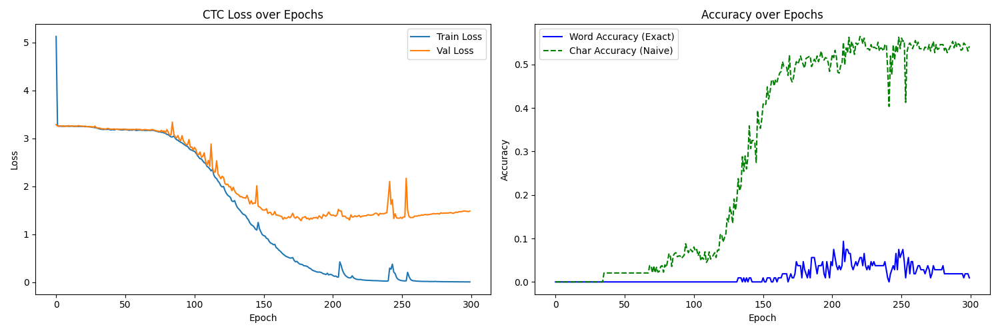
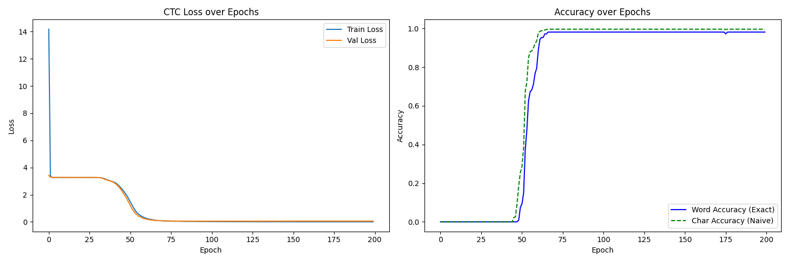
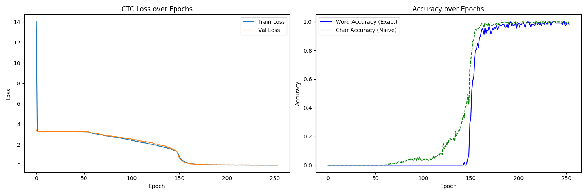
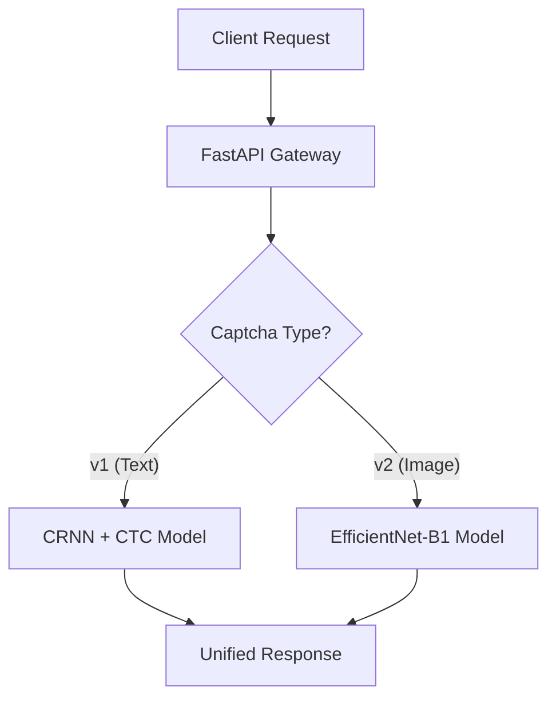

# Captcha Recognition System

An automated end-to-end CAPTCHA recognition system evolved from traditional machine learning to state-of-the-art Deep Learning (CRNN+CTC). This project demonstrates the journey of improving OCR accuracy from 44% to over 98%.

## 🚀 Project Evolution

This project underwent three major phases of technical improvement:

### Phase 1: traditional ML (SVM + HOG)
- **Method**: Character segmentation (Otsu's thresholding) + HOG Feature Extraction + LinearSVC.
- **Limitation**: Highly sensitive to segmentation errors; struggling with overlapping characters.
- **Accuracy**: ~44%.



### Phase 2: Deep Learning (CNN)
- **Method**: Improved segmentation + 4-layer CNN for character classification.
- **Link**: [Original CNN Research](file:///Users/parkyoungdu/Documents/GitHub/Captcha/scripts/train_cnn.py)
- **Accuracy**: ~91% (Character level).



### Phase 3: Sequential Recognition (CRNN + CTC)
- **Method**: **C**NN (Feature extraction) + **R**NN (BLSTM for sequence) + **C**TC Loss (Alignment).
- **Advantage**: **No explicit segmentation required.** Recognizes the entire 5-character sequence as a whole.
- **Accuracy**: **98.13% (Word Accuracy) / 98.88% (Char Accuracy).**



### Phase 4: Multi-modal Expansion (Image Select ReCAPTCHA)
- **Goal**: Beyond text recognition, expanding to **Object Classification** based challenges.
- **Method**: **EfficientNet-B1** backbone for 3x3 grid image classification.
- **Integration**: Unified both Text and Image CAPTCHA into a single **FastAPI** serving platform.


---

## 🏗️ Integrated Architecture: FastAPI Unified Serving
The system is designed as a modular **FastAPI** application that serves multiple types of CAPTCHA models through a unified inference pipeline.



- **Inference Service**: Separate service layers for `v1` and `v2`, sharing a consistent preprocessing and logging logic.
- **Scalable Serving**: Models and preprocessing scripts are encapsulated for seamless deployment across local and cloud environments.

## 📊 Experimental Results (Latest Run)

| Metric | Value | Description |
| :--- | :--- | :--- |
| **Word Accuracy** | **98.13%** | Entire 5-char sequence match (Exact) |
| **Char Accuracy** | **99.63%** | Individual character prediction success |
| **Precision** | **0.99** | Ratio of true positive predictions |
| **F1-Score** | **0.99** | Balanced harmonic mean of P & R |
| **CTC Loss** | **0.0578** | Model convergence error rate |

## 🛠️ Tech Stack

- **Deep Learning**: PyTorch, TorchInfo
- **Backend**: FastAPI (Python 3.13)
- **Tracking**: MLflow (Experiment Logging & Metric Archiving)
- **Frontend**: Glassmorphism UI (Tailwind CSS, Vanilla JS)
- **Verification**: 5-Fold Cross Validation for robust evaluation

## 📂 Project Structure

```text
Captcha/
├── app/                # FastAPI Web Server
│   ├── services/       # OCR & Metadata Logic
│   ├── routers/        # API Endpoints
│   └── templates/      # Dashboard (UI)
├── models/             # Best Weights (.pth) & Metadata (.json)
├── scripts/            # Training, Tuning, & Integration Scripts
├── notebooks/          # Research (Jupyter Notebooks)
└── requirements.txt    # Dependency mapping
```

## 🚦 Getting Started

### 1. Setup Environment
```bash
python -m venv .venv
source .venv/bin/activate
pip install -r requirements.txt
```

### 2. Run Dashboard
```bash
./.venv/bin/python -m uvicorn app.main:app --reload --port 80
```

### 3. Deploy to AWS (EC2)
The project is configured for automated deployment to **AWS EC2** via GitHub Actions & SSH. Both Text and Image CAPTCHA models are bundled into a single Docker image for unified serving.

1. **Integrated Image**: A single Dockerfile handles model weights, metadata, and dependencies for all versions.
2. **Automated CD**: Push to the `main` branch triggers the GitHub Actions pipeline.
3. **Serving Environment**: The workflow pushes the image to Docker Hub and restarts the container on EC2 port **80**.

### 4. Unified Model Deployment Pipeline
To ensure consistent inference between development and production, we use a unified deployment script for both model versions.

- **Standardized Inference**: All models use a `RecaptchaPredictor` pattern (as seen in `scripts/inference.py`) to wrap model loading and preprocessing.
- **Metadata-Driven Dashboard**: `generate_v1_metadata.py` and `generate_v2_metadata.py` extract performance metrics, which are then used to dynamically populate the web dashboard at runtime.


### 3. Run Experiments
```bash
# General training
python scripts/train_crnn_ctc.py

# Robust verification
python scripts/train_crnn_kfold.py
```

---
*Developed as part of an Advanced AI OCR Portfolio. Latest metrics exported via [export_metadata.py](file:///Users/parkyoungdu/Documents/GitHub/Captcha/scripts/export_metadata.py).*